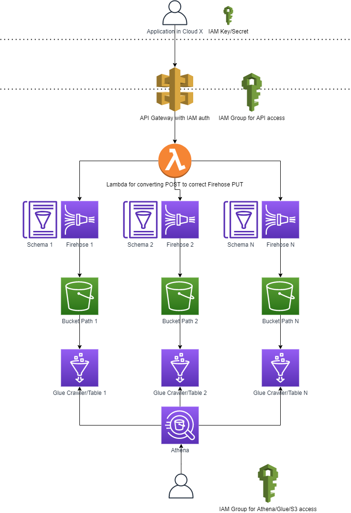

# Xerris Data Mesh

This module creates the basic underlying infrastructure to allow easy, serverless, and scalable AWS data ingestion and storage that can be queried using Athena.

## Requirements

### Before deployment

The following are required before deploying this module:
 - an AWS account
 - CLI user credentials with permission to deploy the specified resources
 - if using the automatic bucket creation ability, you must have python3.x and boto3 installed - if not you can create the bucket manually instead

### After deployment

Once deployed, the following are required:
 - To post data to the endpoint:
     - CLI user credentials that have been added to the API gateway group created

 - To run queries from Athena:
     - a user that has been added to the Athena access group created

## Usage

```hcl
module "xerris_data_mesh" {
  source = "github.com/pwithams/xerris-data-mesh/awsv1"

    # general project information
    resource_prefix = "data-mesh-dev"
    stage           = "dev"

    # s3 details
    bucket_name     = "data-mesh-pwithams-123"
    automate_bucket_creation = true

    # one or more schemas to support
    schemas = {
      schema1 = {
        schema_name = "data_product1"
        schema_details = [
          {
            name = "id"
            type = "int"
          },
          {
            name = "value"
            type = "double"
          }
        ]
      },
      schema2 = {
        schema_name = "data_product2"
        schema_details = [
          {
            name = "id"
            type = "int"
          },
          {
            name = "name"
            type = "string"
          },
          {
            name = "ts"
            type = "timestamp"
          }
        ]
      },
    }
}
```

## S3 bucket creation

When creating a bucket using Terraform, it will always be tied to the Terraform state. This is useful for most cases, but when using the bucket to store important data it poses the risk that the bucket may get deleted, such as when removing and reapplying the state. As a result, it is preferrable to keep the bucket decoupled from the infrastructure.

However, it can still be nice to automate this process, and so by setting `automate_bucket_creation = true` a Python script will create a bucket with encryption for you. It is recommended to remove or set the statement to false once the bucket is created to avoid needlessly running the script each time.

Note that the Python script uses `boto3` to create the bucket and so `python` must have access to this. If `python` does not point to python3.x you can specify `python_path = "python3"`. If you do not have Python or the required libraries available, you can disable automatic bucket creation and just manually create it instead.

## Posting data to the endpoint

Once deployed, you can test out the deployment by using a tool such as Postman to send a test payload.

Assuming the schemas above were specified, an example payload could be:

```
{
    "schema": "data_product2",
    "data": [
        {
            "id": 2,
            "name": "test",
            "ts": "1614841811000"
        }
    ]
}
```

Sent as a POST request sent to your endpoint, similar to `https://[api gateway id].execute-api.us-east-1.amazonaws.com/sink_data/`

## Authentication

IAM credentials are used for authentication, so assuming your credentials either have the required permissions or have been added to the API access group, you can add them under the Authorization section of Postman, under AWS Signature.

If you're using a programming language, you can either sign the request yourself or use a helper module, such as https://pypi.org/project/aws-requests-auth/

For more details about signing requests, see https://docs.aws.amazon.com/general/latest/gr/sigv4_signing.html

## Architecture


